# T3 Stack Gallery

## Project Overview

This project was built using the T3 Stack by Theo, providing a robust foundation for full-stack TypeScript applications. Below is a summary of the technologies and tools utilized in this project.

## Tech Stack Breakdown

### 1. Initializing the Project with T3 Stack

- The project was initialized using the T3 Stack, providing a solid starting point. The folder structure may vary depending on the libraries installed during initialization.


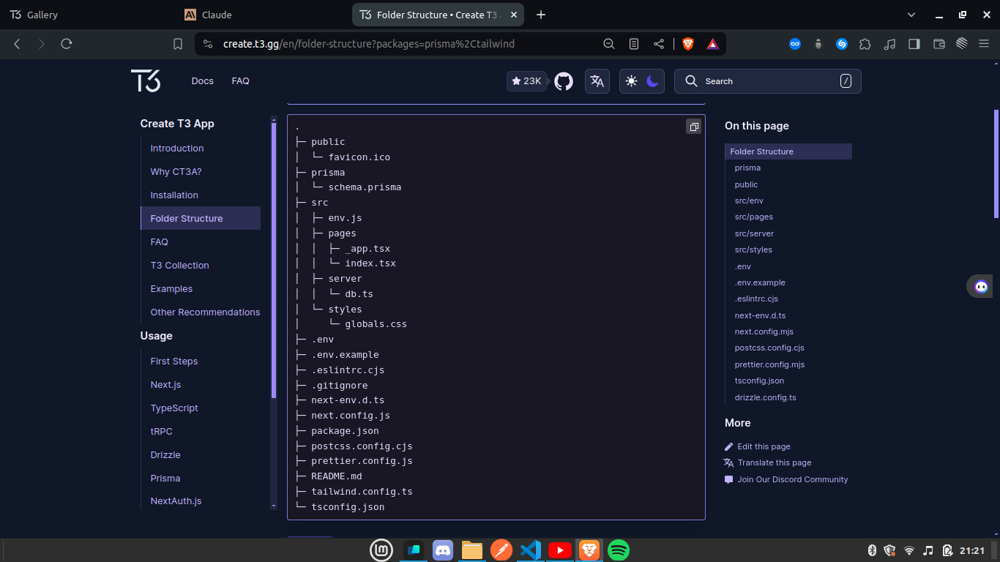

### 2. Shadcn UI for UI Components

- Shadcn UI was integrated for UI components, offering a seamless user interface development experience. Installation steps can be found in the Shadcn UI documentation.

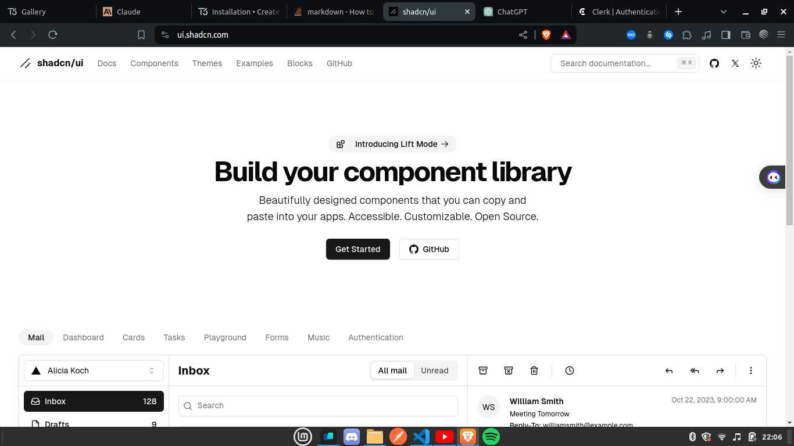

### 3. Authentication with Clerk

- Clerk was integrated for authentication, offering a simple yet powerful solution for user authentication in full-stack applications.

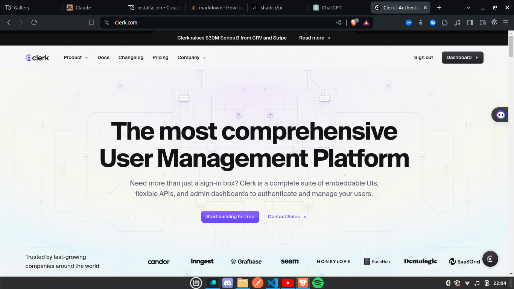

### 4. UploadThing for File Uploads

- UploadThing simplifies file uploads in full-stack TypeScript applications, offering ease of use and flexibility.

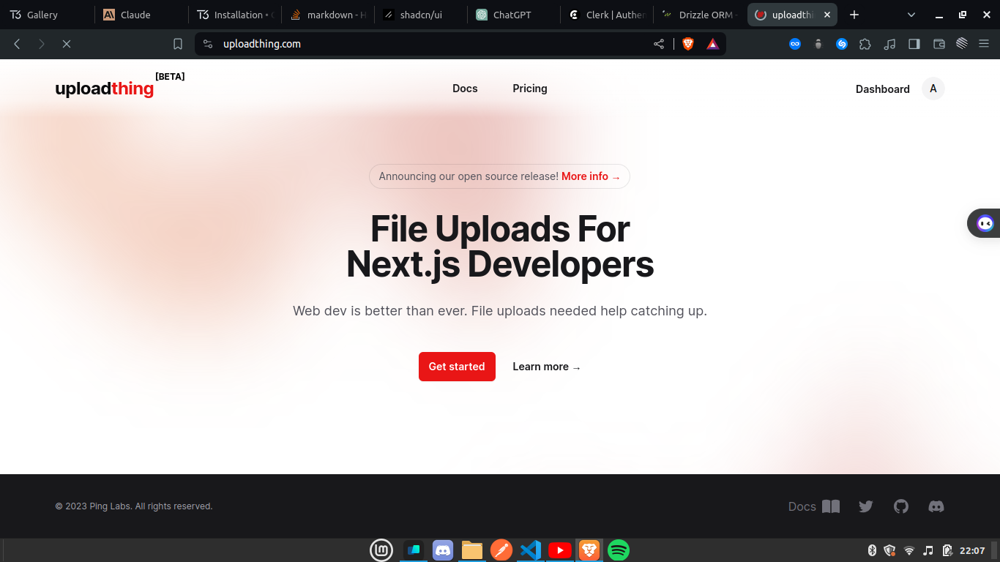

### 5. Drizzle ORM for Data Access

- Drizzle ORM provides both relational and SQL-like query APIs, offering a lightweight, performant, and flexible solution for accessing relational data.

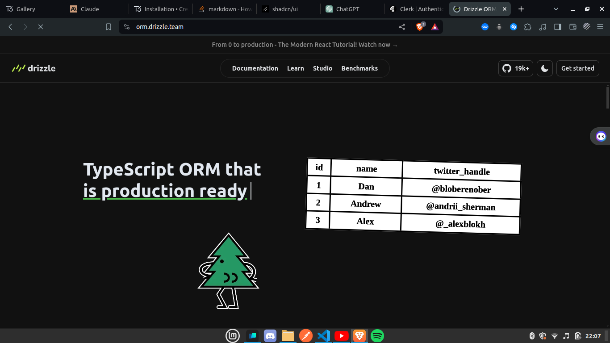

### 6. Vercel Postgres for Scalable Databases

- Vercel Postgres enables the creation of scalable, secure PostgreSQL databases, ideal for managing various types of complex data.

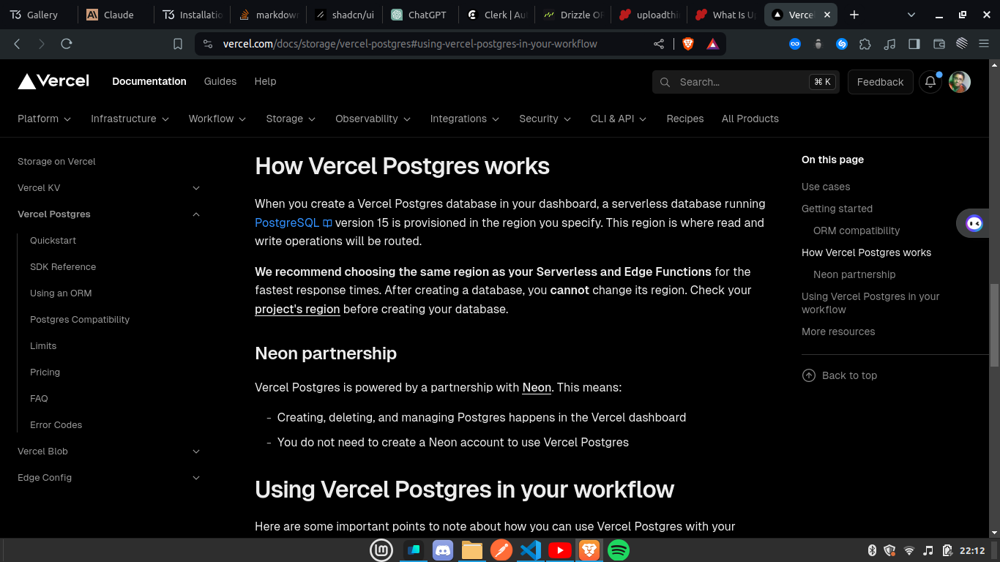

### 7. Sentry for Error Management

- Sentry is a top-tier error management tool, ensuring comprehensive error monitoring and reporting for web applications.

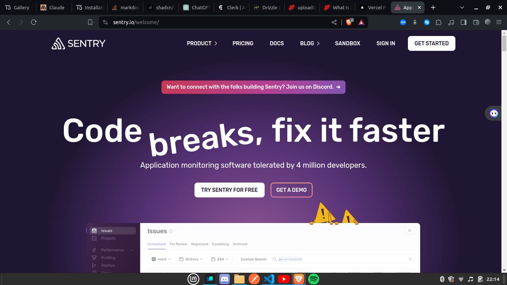

### 8. PostHog for Product Analytics

- PostHog offers a comprehensive product analytics platform, featuring session replay, feature flags, A/B testing, and surveys.

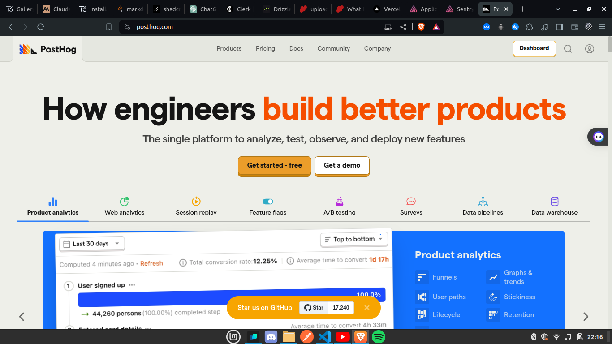

- Example of tracking every activity on your web app with Sentry.

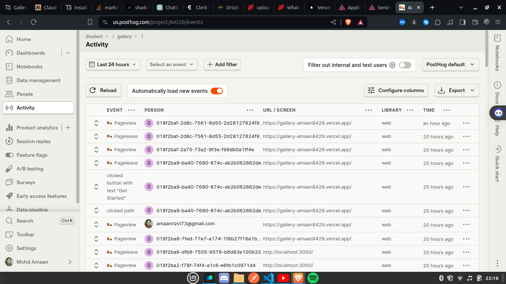

### 9. Upstash for Serverless Database

- Upstash is a serverless database with a Redis API, optimized for serverless applications with per-request pricing and low-latency data storage.

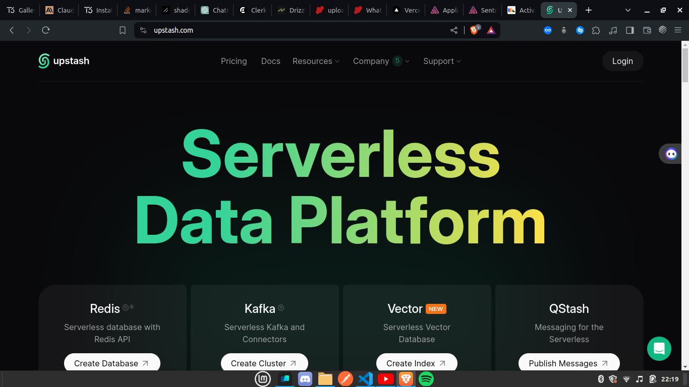

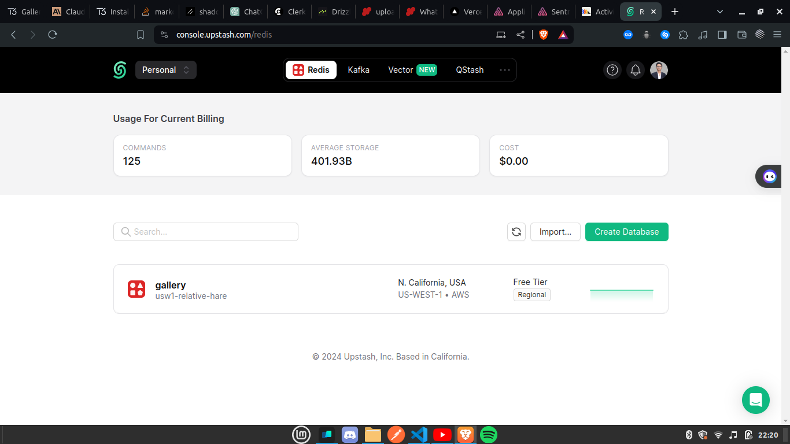

---

Sure, here's the entire section again with the correction:

---

## Contributing to the Next.js Project

We welcome contributions from the community to enhance and improve the project. Here's how you can contribute:

1. **Fork the Repository**: Start by forking the repository to your GitHub account.

2. **Clone the Repository**: Clone the forked repository to your local machine.

   ```bash
   git clone https://github.com/amaan8429/gallery.git
   ```

3. **Install Dependencies**: Navigate to the project directory and install the dependencies.

   ```bash
   cd gallery
   pnpm install
   ```

4. **Make Changes**: Make your desired changes or enhancements to the project.

5. **Test Your Changes**: Test your changes locally to ensure they work as expected.

6. **Commit Your Changes**: Once you're satisfied with your changes, commit them to your forked repository.

   ```bash
   git add .
   git commit -m "Description of your changes"
   ```

7. **Push Changes to a Feature Branch**: Instead of pushing changes directly to the main branch, it's recommended to push changes to a feature branch.

   ```bash
   git push origin your-feature-branch
   ```

8. **Create a Pull Request**: After pushing your changes to your feature branch, create a pull request from your feature branch to the main project repository. Provide a descriptive title and detailed description of your changes in the pull request.

## Setting up the Environment

To set up the environment for the Next.js project, follow these steps:

1. **Clone the `.env.example` File**: Clone the `.env.example` file in the project directory and rename it to `.env`.

2. **Update Environment Variables**: Update the environment variables in the `.env` file according to your project requirements. Refer to the comments in the file for guidance.

   ```plaintext
   POSTGRES_URL="..."
   POSTGRES_PRISMA_URL="..."
   POSTGRES_URL_NO_SSL="..."
   POSTGRES_URL_NON_POOLING="..."
   POSTGRES_USER="..."
   POSTGRES_HOST="..."
   POSTGRES_PASSWORD="..."
   POSTGRES_DATABASE="..."

   NEXT_PUBLIC_CLERK_PUBLISHABLE_KEY="..."
   CLERK_SECRET_KEY="..."

   UPLOADTHING_SECRET="..."
   UPLOADTHING_APP_ID="..."

   SENTRY_DSN="..."
   SENTRY_AUTH_TOKEN="..."

   NEXT_PUBLIC_POSTHOG_KEY="..."
   NEXT_PUBLIC_POSTHOG_HOST="..."

   UPSTASH_REDIS_REST_URL="..."
   UPSTASH_REDIS_REST_TOKEN="..."
   ```

3. **Save Changes**: Save the changes to the `.env` file.

Ensure you keep sensitive information such as API keys and credentials secure and do not expose them publicly.

That's it! Your environment is now set up for the Next.js project. You can now run the project locally or deploy it as needed.

---
